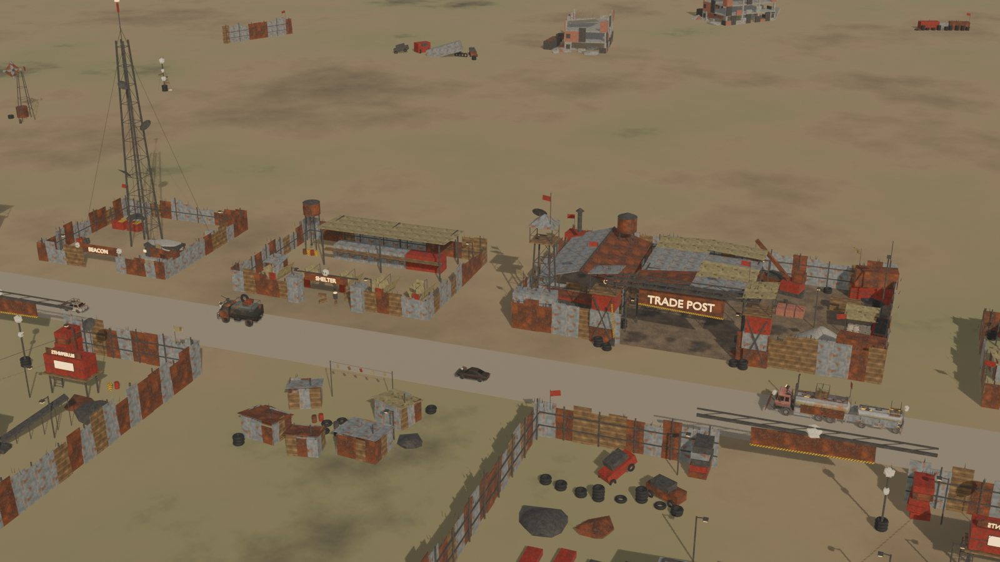
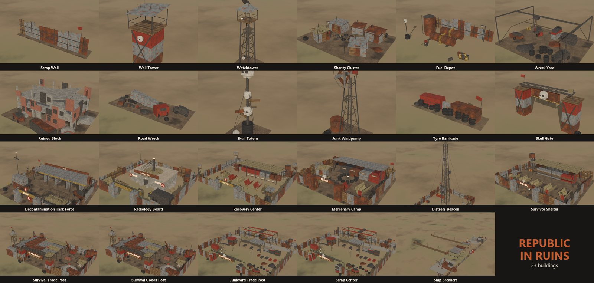
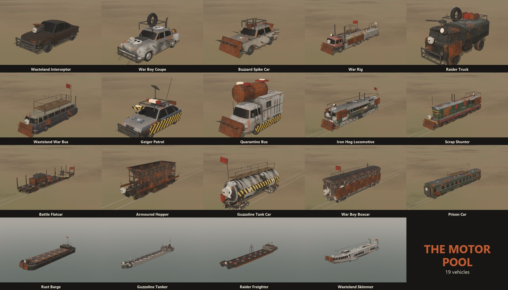

# Republic in Ruins for Workers & Resources: Soviet Republic



*Trade post, shelter, beacon, a war party passing through. Population: whoever is still alive.*

## COMRADE, THE REPUBLIC IS IN RUINS.

The Five-Year Plan has been interrupted by a nuclear exchange. The Central Committee is
unavailable for comment. The Ministry of Construction is a crater.

Your citizens are few, contaminated and hungry? The border is a rumour? The only industry
left is whatever you can dig out of the rubble?

**DO NOT DESPAIR, COMRADE. THE PLAN HAS BEEN AMENDED.**

**Republic in Ruins** turns the game into a post-apocalyptic survival city builder: salvage
the ruins, trade for scraps, take in survivors, keep the radiation off your people and build
the republic back out of what is left of it.

> **Status: early access, like the republic's water supply.** Everything loads in the game and
> the Korea Year Zero start has been played in short sessions; nobody has rebuilt a republic
> with it yet. The parts that have run in the game, and how they were checked, are in
> `docs/development-notes.md`.

## WHAT SURVIVED

- **Contamination instead of crime.** Three strike zones that decay over the years. Citizens in
  buildings inside the field take up a dose (the game's crime level, re-purposed), and a high
  dose costs them their health; newcomers sometimes arrive already exposed. Waste stored near a
  crater radiates too. Clearing the ruins lowers the field. The police are now the
  Decontamination Task Force, the court is the Radiology Board, the prison is the Recovery
  Center, and the patrol cars carry Geiger counters.
- **Survivors instead of immigration.** Nobody can be bought across the border any more.
  Survivors wander in like tourists; the ones you shelter and look after stay as citizens. A
  distress broadcast brings a trickle of newcomers. Mercenaries still come, but they want food,
  meat, clothes and alcohol from a Mercenary Camp, not money: no camp, no mercenaries.
- **Survival Trade Posts.** Scarce goods appear at a trade post at their own pace, and your
  trucks buy them there one load at a time. When the shelves are empty, they are empty.
- **Blueprints from the scrapyard.** Send a vehicle to the Scrap Center (or a ship to the Ship
  Breakers) and your engineers learn to build it. Take apart what you find; build what you
  learn.
- **Salvage.** Twelve pieces of wasteland - scrap walls, watchtowers, shanties, wreck yards,
  fuel depots, a skull gate - placeable anywhere, and ruins that give up construction waste and
  scrap when your salvage crews tear them down.

  
- **Nineteen vehicles** welded together from what was left: road raiders and a war rig, the
  Geiger patrol and the quarantine bus, rail war trains and river ships, each in wasteland
  rust, war-boy chalk and matte black.

  
- **Words.** About 170 lines of the game's English text re-themed for the wasteland: tourists
  are survivors, crime is exposure, prisons are recovery centres.

## KOREA YEAR ZERO

The mod was made for **Korea Year Zero**, a post-strike start converted from BATON's
[North Korea map - Early start version](https://steamcommunity.com/sharedfiles/filedetails/?id=3753525456):

- three strikes - the capital, the east port, the north gate town - with scorched and dusty
  ground in rings around them, the forests thinned and dried out;
- the towns inside the blast replaced by ruins in place, ready for salvage;
- a start kit along the roads out of the capital: a salvage motor pool with three wrecks in it,
  a repair yard, recycling plants, the Scrap Center, the trade post, the survivors' camp, beacon
  and shelter, a farm, food, alcohol, meat and clothes;
- a scenario with no immigrant or vehicle purchases, blueprints only from the scrapyard,
  border prices at four times the usual, and a reunification watch for the win.

**The converted map is not published**, here or on the Workshop: it is built from BATON's work
(and the World Maps DLC terrain under it). The converter is. If you are subscribed to their map
and own the DLCs it needs, build your own copy:

```powershell
.\build.ps1 -Install                  # the mod's items first: the map names them by their item ids
python tools\wasteland_tiles.py       # the three wasteland ground textures (build\tiles)
python tools\yearzero.py              # -> media_soviet\workshop_wip\9000007 (map) and 9000008 (scenario)
```

The converter's other inputs - road points, model bounds and the donor building records it
clones the start kit from - ship in `data/yearzero/`; `tools/map_prep.py` and
`tools/donors.py` remake them from the source map and from your own saves. The contamination
zones in the plugin sit where this map's strikes fell; another map would need new coordinates
at the top of `mod/plugins/fallout/fallout.cpp`.

## HOW TO SURVIVE

1. Install the mod (below) or subscribe to its Workshop items, and
   [Republic Mod Loader](https://steamcommunity.com/sharedfiles/filedetails/?id=3787969749).
2. In Republic Mod Loader enable the Republic in Ruins items and their plugins (fallout,
   scrap_center, survivors, trade_post), then launch.
3. Start the game with **Crime & justice: Enabled** (contamination lives there) and
   **Waste management: Waste + Demolition** (salvage does).

## NOT INCLUDED

- No mutants. The Ministry of Health has ruled them out.
- No working border. Traders come to you, at a price.
- No map on the Workshop: Korea Year Zero is BATON's map underneath; build it yourself above.
- No guarantee that the trade post restocks before winter.

## REQUIREMENTS

- Workers & Resources: Soviet Republic **1.1.1.9**. The plugins patch this exact build and will
  not recognise any other.
- [Republic Mod Loader](https://steamcommunity.com/sharedfiles/filedetails/?id=3787969749) (RML),
  which hosts the plugins.
- To build: Windows, Visual Studio Build Tools (MSVC x64, Windows 10/11 SDK), PowerShell and
  Python 3 (`numpy`, `pillow`).
- To regenerate the models and textures: Blender 5.2. `capstone` only for the
  reverse-engineering helpers.
- For Korea Year Zero: BATON's North Korea map and the DLCs it uses.

## BUILD AND INSTALL

```powershell
.\build.ps1 -Install            # compile the plugins, pack the four Workshop items, deploy them into the game
.\build.ps1 -Install -Game 'D:\Games\SovietRepublic'
```

The mod ships as four items, installed as local development items in `media_soviet\workshop_wip`:

| Item | What |
|---|---|
| 9000090 | *Republic in Ruins*: the plugins `fallout`, `scrap_center`, `survivors`, `trade_post` |
| 9000050 | *Buildings*: all twenty-three, from the eight kits in `mod/buildings` |
| 9000051 | *Vehicles*: all nineteen, from `mod/vehicles` |
| 9000005 | *Words*: the text overlay |

`tools/yearzero_workshop.py` packs them (and holds their Workshop pages). Close the game and the
loader before installing, then open Republic Mod Loader, enable the development items and the
plugins, and launch. Set `WRSR_GAME` (and `WRSR_WORKSHOP` for Steam's workshop content folder)
if the game is not in the default Steam library.

## REBUILDING THE CONTENT

Everything is generated - models, textures, skins, text - from the tools and the game's own files:

```
python tools\build_madmax.py                  # textures, vehicle skins, wasteland kit, vehicles, previews (Blender)
blender -b --python tools\tradepost_scene.py -- build\textures mod\buildings\trade_post\trade_post build
blender -b --python tools\survivors_scene.py -- build\textures mod\buildings\survivors_kit build\survivors
blender -b --python tools\fallout_scene.py -- build\textures mod\buildings\fallout_kit build\fallout
blender -b --python tools\scrap_center_scene.py -- build\textures mod\buildings\scrap_center\scrap_center build
blender -b --python tools\scrap_dock_scene.py -- build\textures mod\buildings\scrap_dock\scrap_dock build
python tools\survivors_text.py                # the text overlay (survivor and contamination words)
python tools\yearzero_readme_images.py        # the pictures on this page (Blender), and the Workshop previews
```

The goods post and the junkyard post use the trade post's and the Scrap Center's models.
`tools/stamp_production.py` writes the posts' production rates from
`mod/plugins/trade_post/trade_post.ini`; `build.ps1 -Install` runs it.

## REPOSITORY LAYOUT

```
mod/plugins/fallout/       contamination: the strike zones, the dose, the radiation grid
mod/plugins/scrap_center/  a scrapyard that disassembles a vehicle teaches its blueprint
mod/plugins/survivors/     survivors who stay, the distress trickle, mercenaries paid in goods
mod/plugins/trade_post/    trade posts bill what trucks load (rates and prices in trade_post.ini)
mod/packages/republic_in_ruins/  the plugins' Workshop item
mod/buildings/             eight kits, twenty-three buildings (generated)
mod/vehicles/              nineteen vehicles (generated from the game's own, with scrap welded on)
mod/text/                  the text overlay (a TEXT item) and the same file for TesmioLoader's VFS
tools/                     generators, the map converter, the Workshop packer, reverse-engineering helpers
tools/dev/                 helpers that drive and capture a running game
data/yearzero/             the map converter's prepared inputs
docs/                      design notes, the feasibility study, development notes and test history
vendor/TesmioLoader/       the loader API headers the plugins build against
```

## BRANCHES

| Branch | What | How changes get in |
|---|---|---|
| `unstable` | day-to-day work; may not build | pushed to directly |
| `dev` | the next release, tested in game | pull request from `unstable`, approved by two maintainers |
| `main` | releases | pull request from `dev`, approved by @aislanfoina (code owner) |

`dev` and `main` are protected: no direct pushes, force pushes or deletions.

## REPORTING A PROBLEM

Open an issue with what happened, what you were doing, and the Republic Mod Loader log
(`rml\logs\rml-runtime.log`). The fallout plugin also logs crashes with their module and offset
there, which is usually enough to find them.

## LICENCE AND CREDITS

GPL-3.0; see `LICENSE`. The plugins build against the GPL-3.0 API headers of
[TesmioLoader](https://github.com/MaxLegend/TesmioLoader) by MaxLegend and run on
[Republic Mod Loader](https://github.com/Ultimate-Universe/WRSR-RepublicModLoader) by
UltimateUniverse. Korea Year Zero is converted from BATON's North Korea map, which is theirs.

Workers & Resources: Soviet Republic is © 3Division. This is an independent fan-made mod, not
affiliated with or endorsed by 3Division or Hooded Horse. The vehicles are the game's own models
with parts added, and the text overlay is the game's own English text with lines changed; both
remain 3Division's work underneath. The look of the vehicles is inspired by the Mad Max films;
this mod is not affiliated with their makers.

---

**Dig. Trade. Shelter. Rebuild.**
**The Republic is not dead, Comrade. It is merely resting in pieces.**
